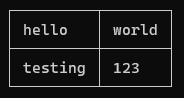
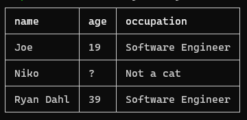
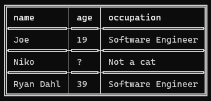
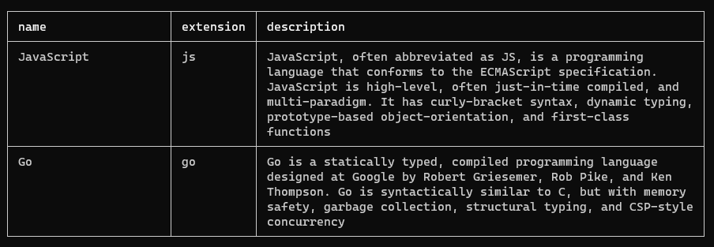

# tbl

Tiny and versatile command-line table generator.

This module is very early in development, so bugs may appear here and there.

## Usage

**Simple table:**

```ts
import { Table } from 'https://deno.land/x/tbl/mod.ts';

const table = new Table(); // this is an array!

table.push([ 'hello', 'world' ]);
table.push([ 'testing', 123 ]);

console.log(table.toString());
```



**Table with header:**

```ts
const table = new Table({
  header: [ 'name', 'age', 'occupation' ]
});

table.push([ 'Joe', 19, 'Software Engineer' ]);
table.push([ 'Niko', '?', 'Not a cat' ]);
table.push([ 'Ryan Dahl', 39, 'Software Engineer' ]);

console.log(table.toString());
```



**Table with custom characters:**

```ts
const table = new Table({
  header: [ 'name', 'age', 'occupation' ],
  chars: {
    middleMiddle: '═', topMiddle: '╤' , topLeft: '╔' , topRight: '╗'
  , bottomMiddle: '╧' , bottomLeft: '╚' , bottomRight: '╝'
  , left: '║' , leftMiddle: '╟' , rowMiddle: '┼'
  , right: '║' , rightMiddle: '╢' , middle: '│'
  }
});
```



**Table with custom cell widths:**

```ts
const languages = new Table({
  header: [ 'name', 'extension', 'description' ],
  widths: [ 20, 0, 60 ] // 0 = width is not fixed
});
```



**Table from array of objects:**

```ts
const users = [
  { name: 'Joe', age: 19, occupation: 'Software Engineer' },
  { name: 'Niko', age: '?', occupation: 'Not a cat' },
  { name: 'Ryan Dahl', age: 39, occupation: 'Software Engineer' }
];

const table = new Table({
  header: [ 'name', 'age', 'occupation' ]
  // specifying the header is necessary
});

table.fromObjects(users);
console.log(table.toString());
```


## License

MIT.
